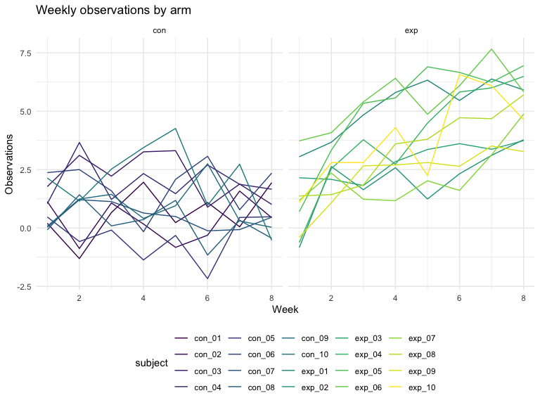

p8105\_hw5\_md3851
================
Misbath Daouda
11/3/2019

Problem 1
---------

Loading Iris dataset

``` r
set.seed(10)

iris_with_missing = iris %>% 
  map_df(~replace(.x, sample(1:150, 20), NA)) %>%
  mutate(Species = as.character(Species)) %>% 
  view()
```

Tidying Iris dataset

``` r
cleaning = function(x) {
  
   if(is.numeric(x)) {
   replace_na(x, round(mean(x, na.rm = TRUE)))
   }
   else if (is.character(x)) 
     {replace_na(x, "virginica")}
}

output = map_dfr(.x = iris_with_missing, ~ cleaning(.x))
output
```

    ## # A tibble: 150 x 5
    ##    Sepal.Length Sepal.Width Petal.Length Petal.Width Species
    ##           <dbl>       <dbl>        <dbl>       <dbl> <chr>  
    ##  1          5.1         3.5          1.4         0.2 setosa 
    ##  2          4.9         3            1.4         0.2 setosa 
    ##  3          4.7         3.2          1.3         0.2 setosa 
    ##  4          4.6         3.1          1.5         1   setosa 
    ##  5          5           3.6          1.4         0.2 setosa 
    ##  6          5.4         3.9          1.7         0.4 setosa 
    ##  7          6           3.4          1.4         0.3 setosa 
    ##  8          5           3.4          1.5         0.2 setosa 
    ##  9          4.4         2.9          1.4         0.2 setosa 
    ## 10          4.9         3.1          4           0.1 setosa 
    ## # … with 140 more rows

Problem 2
---------

``` r
names_df = 
  tibble(
  subject = list.files(path="./data")
)

file_path = "./data/"
file_names = file_path %>% 
  list.files()

observations_df = 
  file_names %>%
  map_dfr(function(file_name){
  
  read_csv(paste0(file_path, file_name))
}) 
```

    ## Parsed with column specification:
    ## cols(
    ##   week_1 = col_double(),
    ##   week_2 = col_double(),
    ##   week_3 = col_double(),
    ##   week_4 = col_double(),
    ##   week_5 = col_double(),
    ##   week_6 = col_double(),
    ##   week_7 = col_double(),
    ##   week_8 = col_double()
    ## )
    ## Parsed with column specification:
    ## cols(
    ##   week_1 = col_double(),
    ##   week_2 = col_double(),
    ##   week_3 = col_double(),
    ##   week_4 = col_double(),
    ##   week_5 = col_double(),
    ##   week_6 = col_double(),
    ##   week_7 = col_double(),
    ##   week_8 = col_double()
    ## )
    ## Parsed with column specification:
    ## cols(
    ##   week_1 = col_double(),
    ##   week_2 = col_double(),
    ##   week_3 = col_double(),
    ##   week_4 = col_double(),
    ##   week_5 = col_double(),
    ##   week_6 = col_double(),
    ##   week_7 = col_double(),
    ##   week_8 = col_double()
    ## )
    ## Parsed with column specification:
    ## cols(
    ##   week_1 = col_double(),
    ##   week_2 = col_double(),
    ##   week_3 = col_double(),
    ##   week_4 = col_double(),
    ##   week_5 = col_double(),
    ##   week_6 = col_double(),
    ##   week_7 = col_double(),
    ##   week_8 = col_double()
    ## )
    ## Parsed with column specification:
    ## cols(
    ##   week_1 = col_double(),
    ##   week_2 = col_double(),
    ##   week_3 = col_double(),
    ##   week_4 = col_double(),
    ##   week_5 = col_double(),
    ##   week_6 = col_double(),
    ##   week_7 = col_double(),
    ##   week_8 = col_double()
    ## )
    ## Parsed with column specification:
    ## cols(
    ##   week_1 = col_double(),
    ##   week_2 = col_double(),
    ##   week_3 = col_double(),
    ##   week_4 = col_double(),
    ##   week_5 = col_double(),
    ##   week_6 = col_double(),
    ##   week_7 = col_double(),
    ##   week_8 = col_double()
    ## )
    ## Parsed with column specification:
    ## cols(
    ##   week_1 = col_double(),
    ##   week_2 = col_double(),
    ##   week_3 = col_double(),
    ##   week_4 = col_double(),
    ##   week_5 = col_double(),
    ##   week_6 = col_double(),
    ##   week_7 = col_double(),
    ##   week_8 = col_double()
    ## )
    ## Parsed with column specification:
    ## cols(
    ##   week_1 = col_double(),
    ##   week_2 = col_double(),
    ##   week_3 = col_double(),
    ##   week_4 = col_double(),
    ##   week_5 = col_double(),
    ##   week_6 = col_double(),
    ##   week_7 = col_double(),
    ##   week_8 = col_double()
    ## )
    ## Parsed with column specification:
    ## cols(
    ##   week_1 = col_double(),
    ##   week_2 = col_double(),
    ##   week_3 = col_double(),
    ##   week_4 = col_double(),
    ##   week_5 = col_double(),
    ##   week_6 = col_double(),
    ##   week_7 = col_double(),
    ##   week_8 = col_double()
    ## )
    ## Parsed with column specification:
    ## cols(
    ##   week_1 = col_double(),
    ##   week_2 = col_double(),
    ##   week_3 = col_double(),
    ##   week_4 = col_double(),
    ##   week_5 = col_double(),
    ##   week_6 = col_double(),
    ##   week_7 = col_double(),
    ##   week_8 = col_double()
    ## )
    ## Parsed with column specification:
    ## cols(
    ##   week_1 = col_double(),
    ##   week_2 = col_double(),
    ##   week_3 = col_double(),
    ##   week_4 = col_double(),
    ##   week_5 = col_double(),
    ##   week_6 = col_double(),
    ##   week_7 = col_double(),
    ##   week_8 = col_double()
    ## )
    ## Parsed with column specification:
    ## cols(
    ##   week_1 = col_double(),
    ##   week_2 = col_double(),
    ##   week_3 = col_double(),
    ##   week_4 = col_double(),
    ##   week_5 = col_double(),
    ##   week_6 = col_double(),
    ##   week_7 = col_double(),
    ##   week_8 = col_double()
    ## )
    ## Parsed with column specification:
    ## cols(
    ##   week_1 = col_double(),
    ##   week_2 = col_double(),
    ##   week_3 = col_double(),
    ##   week_4 = col_double(),
    ##   week_5 = col_double(),
    ##   week_6 = col_double(),
    ##   week_7 = col_double(),
    ##   week_8 = col_double()
    ## )
    ## Parsed with column specification:
    ## cols(
    ##   week_1 = col_double(),
    ##   week_2 = col_double(),
    ##   week_3 = col_double(),
    ##   week_4 = col_double(),
    ##   week_5 = col_double(),
    ##   week_6 = col_double(),
    ##   week_7 = col_double(),
    ##   week_8 = col_double()
    ## )
    ## Parsed with column specification:
    ## cols(
    ##   week_1 = col_double(),
    ##   week_2 = col_double(),
    ##   week_3 = col_double(),
    ##   week_4 = col_double(),
    ##   week_5 = col_double(),
    ##   week_6 = col_double(),
    ##   week_7 = col_double(),
    ##   week_8 = col_double()
    ## )
    ## Parsed with column specification:
    ## cols(
    ##   week_1 = col_double(),
    ##   week_2 = col_double(),
    ##   week_3 = col_double(),
    ##   week_4 = col_double(),
    ##   week_5 = col_double(),
    ##   week_6 = col_double(),
    ##   week_7 = col_double(),
    ##   week_8 = col_double()
    ## )
    ## Parsed with column specification:
    ## cols(
    ##   week_1 = col_double(),
    ##   week_2 = col_double(),
    ##   week_3 = col_double(),
    ##   week_4 = col_double(),
    ##   week_5 = col_double(),
    ##   week_6 = col_double(),
    ##   week_7 = col_double(),
    ##   week_8 = col_double()
    ## )
    ## Parsed with column specification:
    ## cols(
    ##   week_1 = col_double(),
    ##   week_2 = col_double(),
    ##   week_3 = col_double(),
    ##   week_4 = col_double(),
    ##   week_5 = col_double(),
    ##   week_6 = col_double(),
    ##   week_7 = col_double(),
    ##   week_8 = col_double()
    ## )
    ## Parsed with column specification:
    ## cols(
    ##   week_1 = col_double(),
    ##   week_2 = col_double(),
    ##   week_3 = col_double(),
    ##   week_4 = col_double(),
    ##   week_5 = col_double(),
    ##   week_6 = col_double(),
    ##   week_7 = col_double(),
    ##   week_8 = col_double()
    ## )
    ## Parsed with column specification:
    ## cols(
    ##   week_1 = col_double(),
    ##   week_2 = col_double(),
    ##   week_3 = col_double(),
    ##   week_4 = col_double(),
    ##   week_5 = col_double(),
    ##   week_6 = col_double(),
    ##   week_7 = col_double(),
    ##   week_8 = col_double()
    ## )

``` r
study_data = cbind(names_df, observations_df) %>%
 mutate(subject = str_replace(subject, ".csv", "")) %>%
 pivot_longer(
    week_1:week_8,
    names_to = "week",
    names_prefix = "week_",
    values_to = "observations") %>%
 mutate(arm_id = subject) %>% 
 separate(arm_id, into = c("arm", "id"), sep = "_") %>% 
 select(-id)
  

study_data %>%
  ggplot(aes(x = as.numeric(week), y = observations, color = subject)) +
  geom_line() + 
  labs(
       title = "Weekly observations by arm", 
       x = "Week",
       y = "Observations") + 
  facet_grid(~arm)
```

 The plot above shows weekly observations for each participant by study group (control vs experimental). On average, the observations are higher in the experimental group compared to the control group. However, in both groups, there is a lot of variations at two levels: 1) between individuals and 2) for each individual from one week to another.

Problem 3
---------

``` r
sim_regression = function(n = 30, beta0 = 2, beta1 = 0, sigma_sq = 50) {

  sim_data = tibble(
    x = rnorm(n),
    y = beta0 + beta1 * x + rnorm(n, 0, sigma_sq)
  )
  
  ls_fit = lm(y ~ x, data = sim_data) %>% 
    tidy() %>%
    select(-std.error, -statistic)
}


sim_results = 
  tibble(beta1 = 0:6) %>% 
  mutate(
    output_lists = map(.x = beta1, ~rerun(1000, sim_regression(beta1 = .x))),
    estimate_dfs = map(output_lists, bind_rows)) %>% 
  select(-output_lists) %>% 
  unnest(estimate_dfs)
```

``` r
fig_1 =
sim_results %>%
  group_by(beta1) %>%
  summarize(n = n(),
            prop_sig = sum(p.value < .05)/n()*100) %>%
ggplot(aes(x = beta1, y = prop_sig)) + 
  geom_point() + 
  geom_smooth(se = FALSE) + 
  labs(x = "Value of Beta1", y = "Proportion Null Rejected", title = "Proportion of times null rejected")

fig_1
```

    ## `geom_smooth()` using method = 'loess' and formula 'y ~ x'


The plot above shows that the association between effect size (Beta1) is overall positively associated with power (proportion of times the null was rejected). However, this relationship is not linear.

``` r
fig_2 = 
  sim_results %>%
  group_by(beta1) %>%
  mutate(average_estimate = mean(estimate)) %>%
  ggplot(aes(x = beta1, y = average_estimate)) + 
  geom_point() + 
  geom_line() + 
  labs(x = "Beta1", y = "Mean Estimate Beta1", title = "Avg estimate Beta1 vs. Beta1")

fig_2
```


``` r
fig_3 = 
  sim_results %>%
  filter(p.value < .05) %>%
  group_by(beta1) %>%
  mutate(average_estimate = mean(estimate)) %>%
  ggplot(aes(x = beta1, y = average_estimate)) + 
  geom_point() + 
  geom_line() + 
  labs(x = "Beta1", y = "Mean Estimate Beta1", title = "Avg estimate Beta1 in significant samples")

fig_3
```


The average estimated Beta 1 does not approximate the true Beta1 for tests in which the null was rejected. This is because the cases in which the null was rejected are those that are significantly different from the truth (i.e. the true B1). The significant tests tend to overestimate the true beta1. For higher true values of Beta1, the mean estimated Beta1 values that have p values &lt; 0.05 are farther away from 0 and drive the difference between the overall average estimate and significant average estimate.
